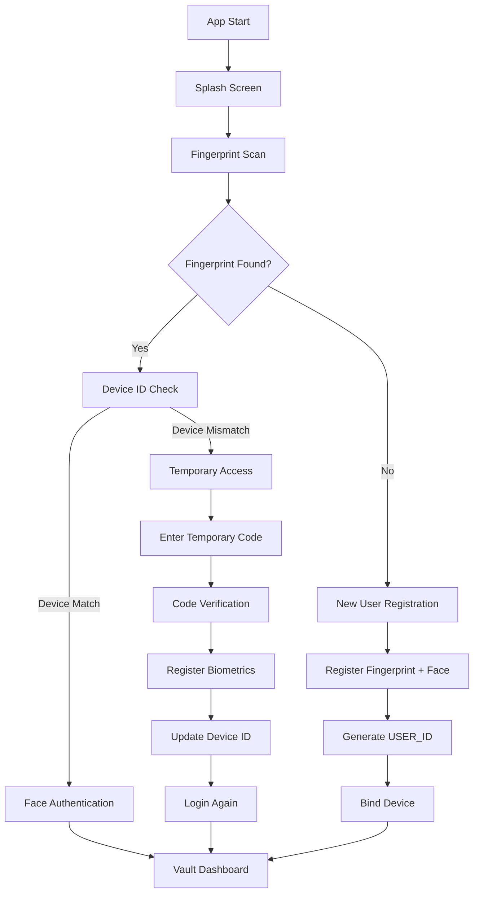

# Biovault App

## Project Info

This repository contains the Biovault mobile/web app, a biometric vault demo built with Vite + React + TypeScript and packaged with Capacitor for Android.

## Tech Stack

- Vite
- TypeScript
- React
- shadcn-ui
- Tailwind CSS
- Capacitor (Android)
- Express (mock backend)

## Current Work (What I am doing)

The following items describe the active implementation workflow in this project:

- Implement biometric-first login (fingerprint with secure fallback behavior).
- Validate user + device binding through backend API checks.
- Support temporary access flow when device mismatch occurs.
- Support first-time user registration with biometric enrollment.
- Keep backend verification isolated from raw biometric payloads.
- Build and test Android debug APK through Capacitor + Gradle.
- Improve routing and error-handling paths for login and registration.

## Workflow Graph



### Detailed Flow Diagram

```
                           ┌─────────────────────┐
                           │  Fingerprint Scan   │
                           └──────────┬──────────┘
                                      │
                           ┌──────────▼──────────┐
                           │ Check Fingerprint   │
                           └─────┬──────────┬────┘
                                 │          │
                    ┌────────────┬┴┐    ┌──┴────────────────┐
                    │                   │                   │
                    │                   │                   │
        ┌───────────▼──────────┐    ┌─────────────▼───────────┐
        │  Found (Green)        │    │  Not Found (Red)        │
        └───────────┬──────────┘    └─────────────┬───────────┘
                    │                             │
        ┌───────────▼──────────────┐   ┌─────────▼──────────┐
        │  Device ID Check         │   │ Generate Temp Code │
        └───┬──────────────────┬───┘   └─────────┬──────────┘
            │                  │                  │
     ┌──────▼──┐        ┌──────▼─────┐   ┌───────▼──────────┐
     │ Match   │        │  Mismatch  │   │ Register         │
     │(Green)  │        │  (Red)     │   │ Biometrics       │
     └──────┬──┘        └──────┬─────┘   └───────┬──────────┘
            │                  │                  │
     ┌──────▼──────────┐  ┌────▼──────────┐  ┌────▼──────────────┐
     │ Biometric +     │  │ Temporary     │  │ Register Face     │
     │ Face Auth       │  │ Access        │  │ Authentication    │
     └──────┬──────────┘  └────┬──────────┘  └────┬──────────────┘
            │                  │                  │
     ┌──────▼──────────┐  ┌────▼────────────┐  ┌──▼───────────────┐
     │ Dashboard       │  │ Face Auth       │  │ Generate Unique  │
     │ (Green)         │  │ Verify          │  │ ID               │
     └─────────────────┘  └────┬────────────┘  └────┬──────────────┘
                                │                    │
                          ┌─────▼──────────────┐   ┌─▼────────────┐
                          │ Restricted        │   │ Login Again  │
                          │ Dashboard (Red)   │   └─────┬────────┘
                          └───────────────────┘         │
                                                 ┌──────▼─────────┐
                                                 │ Dashboard      │
                                                 │ (Green)        │
                                                 └────────────────┘
```

## What Was Changed In This Phase

- `src/pages/Login.tsx`: Updated routing and error handling to match the workflow.
- `src/pages/Index.tsx`: Replaced landing page behavior with splash-driven navigation.
- `src/components/FingerprintScanner.tsx`: Improved biometric fallback behavior and API integration.
- `src/pages/Register.tsx`: Fixed enrollment flow and backend request behavior.
- `android/app/capacitor.build.gradle`: Updated Java/Gradle compatibility settings.
- `android/capacitor-cordova-android-plugins/build.gradle`: Updated Java/Gradle compatibility settings.
- Android debug APK output available at `android/app/build/outputs/apk/debug/app-debug.apk`.

## API Endpoints (Mock Backend)

The mock backend is implemented in `server/index.js`. Default port is `3333` (override with `PORT`).

- `POST /api/register`: body `{ userId, deviceToken, webauthn?, faceEmbedding? }`
- `POST /api/validate`: body `{ userId, deviceToken }` (returns auth result)
- `POST /api/face`: body `{ userId, embedding }`
- `GET /`: health endpoint

By default, the backend stores data in-memory. If `FIREBASE_SERVICE_ACCOUNT_JSON` or `FIREBASE_SERVICE_ACCOUNT_PATH` is configured, Firestore can be used.

## Local Run Steps (Web + Backend)

```bash
npm install
```

Set `VITE_API_URL` in `.env` to your machine LAN IP + backend port.
Example: `VITE_API_URL=http://192.168.1.42:3333`

Start backend:

```powershell
npm install --prefix server
npm start --prefix server
```

Start app:

```bash
npm run dev
```

## Android Build and Run

```bash
npm run build
npx cap sync android
npx cap open android
```

From `android` folder:

```powershell
./gradlew assembleDebug
./gradlew installDebug
```

APK path: `android/app/build/outputs/apk/debug/app-debug.apk`

## Notes

- Use LAN IP in `VITE_API_URL` for physical device testing.
- Ensure phone and dev machine are on the same network.
- If install fails from CLI, open Android Studio and run from there.
- Java 17 is expected by the current Android Gradle configuration.
- If `VITE_API_URL` is not set (or points to localhost), the app now runs in local standalone mode. This allows the APK to run on any phone without your local backend.

## Release build & signing

The project now produces a release APK (unsigned) by default. To create a production-signed APK or AAB, follow these steps:

1. Create a release keystore (example using Java `keytool`):

```bash
keytool -genkeypair -v -keystore ~/biovault-release.jks -alias biovault_key -keyalg RSA -keysize 2048 -validity 10000
```

2. Add signing properties to your Gradle properties (either `~/.gradle/gradle.properties` or `android/gradle.properties`):

```
RELEASE_STORE_FILE=/absolute/path/to/biovault-release.jks
RELEASE_STORE_PASSWORD=your_store_password
RELEASE_KEY_ALIAS=biovault_key
RELEASE_KEY_PASSWORD=your_key_password
```

3. Build a signed release APK (from project root):

```bash
cd android
./gradlew assembleRelease
```

If you provided signing properties, Gradle will produce a signed APK at `android/app/build/outputs/apk/release/app-release.apk`. If signing properties are not present you will get an unsigned APK at `android/app/build/outputs/apk/release/app-release-unsigned.apk` which you can sign manually with `apksigner`.

Manual signing example (if you kept unsigned APK):

```bash
# sign
apksigner sign --ks ~/biovault-release.jks --out app-release-signed.apk app-release-unsigned.apk
# verify
apksigner verify app-release-signed.apk
```

Notes:
- The app enforces TLS by default (cleartext disabled). If you need temporary cleartext access to specific development endpoints, add a domain-config entry to `android/app/src/main/res/xml/network_security_config.xml`.
- User data in standalone mode is stored per-device in local storage; to share accounts across devices deploy a remote backend and set `VITE_API_URL` to its URL.
