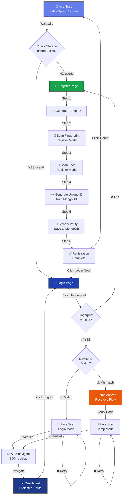
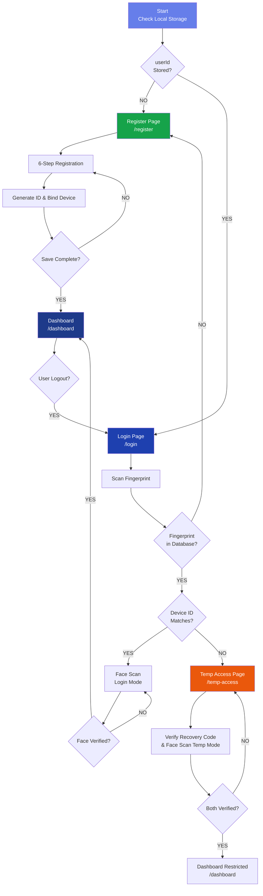
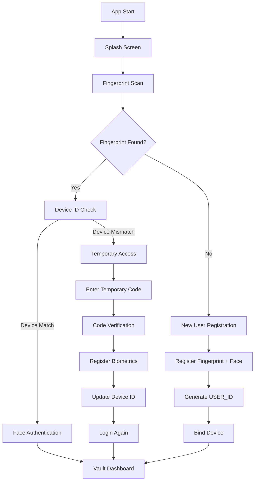
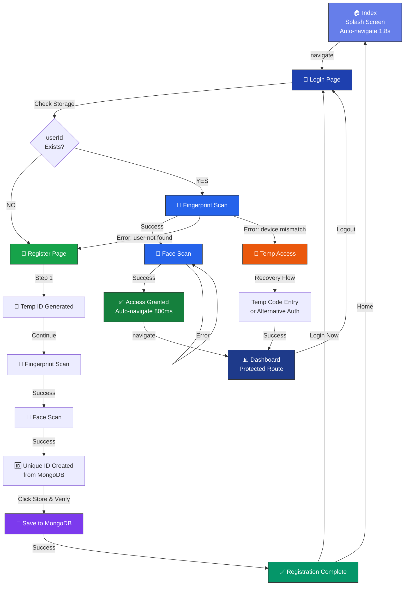

# Biovault App

## Project Info

This repository contains the Biovault mobile/web app, a biometric vault demo built with Vite + React + TypeScript and packaged with Capacitor for Android.

## Tech Stack

- Vite
- TypeScript
- React
- shadcn-ui
- Tailwind CSS
- Capacitor (Android)
- Express (mock backend)

## Quick Start - App Flow Overview

The **Biovault App** is a biometric-first authentication system with three main user pathways:

| Scenario | Flow | Outcome |
|----------|------|---------|
| 🆕 **New User** | Register → Scan Fingerprint → Scan Face → Create Account → Dashboard | Full Access |
| ✅ **Returning User (Same Device)** | Login → Scan Fingerprint → Device Check ✓ → Scan Face → Dashboard | Full Access |
| ⚠️ **Returning User (New Device)** | Login → Scan Fingerprint → Device Check ✗ → Temp Access → Verify Code → Dashboard | Limited Access |

**Key Routes**: `/ (Splash)` → `/login` or `/register` → `/dashboard` (or `/temp-access`)

## Current Work (What I am doing)

The following items describe the active implementation workflow in this project:

- Implement biometric-first login (fingerprint with secure fallback behavior).
- Validate user + device binding through backend API checks.
- Support temporary access flow when device mismatch occurs.
- Support first-time user registration with biometric enrollment.
- Keep backend verification isolated from raw biometric payloads.
- Build and test Android debug APK through Capacitor + Gradle.
- Improve routing and error-handling paths for login and registration.

## App Navigation Flow

### **Routes & Pages Structure**

```
Root (BrowserRouter)
├── / ...................... Index (Splash Screen) 
├── /login .................. Login Page
├── /register ............... Register Page
├── /temp-access ............ Temporary Access (Device Mismatch)
├── /dashboard .............. Dashboard (Protected Route)
└── /* ...................... 404 Not Found
```

### **Complete User Journey**



### **Page-by-Page Flow Breakdown**

#### **1️⃣ Index Page (`/`)**
- **Purpose**: Splash screen with automatic navigation
- **What Happens**:
  - App starts and displays splash screen
  - Waits 1.8 seconds
  - Checks if `userId` exists in storage
  - If YES → Navigate to `/login`
  - If NO → Navigate to `/register`
- **Next Routes**: `/login` or `/register`

#### **2️⃣ Login Page (`/login`)**
- **Purpose**: Authenticate existing users
- **User Scenarios**:
  - ✅ **Returning User (Correct Device)**: Fingerprint → Device Check → Face Auth → Dashboard
  - ⚠️ **Device Mismatch**: Fingerprint → Device Check fails → Temp Access
  - ❌ **User Not Found**: Fingerprint lookup fails → Back to Register
- **What Happens**:
  1. Render login UI with FingerprintScanner component
  2. User scans fingerprint
  3. Check if fingerprint exists in MongoDB
  4. If found: Check if device ID matches
     - **Match**: Proceed to face authentication (login mode)
     - **Mismatch**: Redirect to `/temp-access`
  5. If not found: Redirect to `/register`
- **Success**: Auto-navigate to `/dashboard` (800ms delay)
- **Next Routes**: `/dashboard`, `/register`, `/temp-access`

#### **3️⃣ Register Page (`/register`)**
- **Purpose**: Create new user account with biometric enrollment
- **What Happens**:
  1. Generate temporary ID
  2. Scan fingerprint (register mode) → Store in MongoDB
  3. Scan face (register mode) → Generate face embedding & store
  4. Generate unique USER_ID from MongoDB
  5. Bind device to user account
  6. Click "Store & Verify" → Save all data to MongoDB
  7. Show "Registration Complete" message
- **User Options After Registration**:
  - Click "Login Now" → Go to `/login`
  - Click "Home" → Go to `/`
- **Next Routes**: `/login`, `/`

#### **4️⃣ Temp Access Page (`/temp-access`)**
- **Purpose**: Handle device mismatch scenario for existing users
- **What Happens**:
  1. User's fingerprint found but device ID doesn't match
  2. Show recovery options (temporary code entry or alternative auth)
  3. Verify temporary code
  4. Scan face (temp mode) for additional verification
  5. Complete device rebinding
  6. Update device binding in MongoDB
- **Success**: Navigate to `/dashboard` (with temporary access token)
- **Restrictions**: Dashboard features are restricted until device is fully trusted
- **Next Routes**: `/dashboard`

#### **5️⃣ Dashboard Page (`/dashboard`) - Protected Route**
- **Purpose**: Main vault interface (protected route requires authentication)
- **What Happens**:
  1. ProtectedRoute component verifies user authentication
  2. If user not authenticated → Redirect to `/login`
  3. If authenticated → Show Dashboard UI
  4. User can access vault features:
     - 👤 Profile management
     - 💼 Wallet section
     - 🖼️ Images/media vault
     - ⚙️ Settings
     - 🚪 Logout button
- **Logout**: Click logout → Navigate back to `/login`
- **Next Routes**: `/login` (via logout)

### **Decision Tree**



### **Workflow Graph (Original Diagram)**



### **Detailed Flow Diagram**

```
┌─────────────────────────────────────────────────────────────────┐
│                      APP INITIALIZATION                         │
│                                                                  │
│  1. App starts → Render Index component (Splash Screen)        │
│  2. Show loading/splash for 1.8 seconds                        │
│  3. Check localStorage for saved userId                        │
│                                                                  │
│  ┌──────────────────────┬──────────────────────────────┐       │
│  │         NO           │            YES               │       │
│  │  userId found?       │  userId found?               │       │
│  └──────────────────────┴──────────────────────────────┘       │
│         │                          │                           │
│         ▼                          ▼                           │
│  Navigate to /register      Navigate to /login                │
└─────────────────────────────────────────────────────────────────┘

┌─────────────────────────────────────────────────────────────────┐
│                    NEW USER REGISTRATION FLOW                   │
│                        (/register route)                        │
│                                                                  │
│  Step 1: Generate Temporary ID                                 │
│  Step 2: Scan Fingerprint (register mode)                      │
│           → Store in MongoDB with user temp ID                 │
│  Step 3: Scan Face (register mode)                             │
│           → Save face embedding                                │
│  Step 4: Generate Unique USER_ID from MongoDB                 │
│  Step 5: Click "Store & Verify" button                         │
│           → POST to MongoDB with all biometrics                │
│  Step 6: Registration Success → Options:                       │
│           • "Login Now" → /login                               │
│           • "Home" → /                                         │
│                                                                  │
│  Result: Full access to /dashboard                             │
└─────────────────────────────────────────────────────────────────┘

┌─────────────────────────────────────────────────────────────────┐
│                   RETURNING USER LOGIN FLOW                     │
│                        (/login route)                           │
│                                                                  │
│  Step 1: Display login UI with FingerprintScanner              │
│  Step 2: User scans fingerprint                                │
│  Step 3: App queries MongoDB with fingerprint ID              │
│                                                                  │
│  ┌─────────────────────────────────────────────────┐           │
│  │  OUTCOME 1: Fingerprint NOT Found (New User)   │           │
│  │  → Redirect to /register                        │           │
│  │  → User follows registration flow               │           │
│  └─────────────────────────────────────────────────┘           │
│                                                                  │
│  ┌─────────────────────────────────────────────────┐           │
│  │  OUTCOME 2: Fingerprint Found + Device Match   │           │
│  │  → Device ID verification passes ✓              │           │
│  │  → Display FaceScanner (login mode)             │           │
│  │  → User scans face                              │           │
│  │  ┌──────────────────────────────────────────┐   │           │
│  │  │ Face Verified? → Dashboard (/dashboard)  │   │           │
│  │  │ Face Failed? → Retry face scan (loop)    │   │           │
│  │  └──────────────────────────────────────────┘   │           │
│  │  → Auto-navigate to /dashboard (800ms delay)    │           │
│  │  → Full access to vault features                │           │
│  └─────────────────────────────────────────────────┘           │
│                                                                  │
│  ┌─────────────────────────────────────────────────┐           │
│  │  OUTCOME 3: Fingerprint Found + Device Mismatch│           │
│  │  → Device ID verification fails ✗               │           │
│  │  → Redirect to /temp-access                     │           │
│  │  → Recovery flow (code entry + face scan)       │           │
│  │  → Limited dashboard access                     │           │
│  │  → Device rebinding happens                     │           │
│  └─────────────────────────────────────────────────┘           │
│                                                                  │
│  Result: Either dashboard OR temp-access OR register           │
└─────────────────────────────────────────────────────────────────┘

┌─────────────────────────────────────────────────────────────────┐
│                  TEMPORARY ACCESS FLOW (Device Mismatch)        │
│                      (/temp-access route)                       │
│                                                                  │
│  Triggered when: Fingerprint found but device ID doesn't match │
│                                                                  │
│  Step 1: Display temporary recovery options                    │
│  Step 2: User enters temporary code OR completes alt auth      │
│  Step 3: Verify temporary code against MongoDB                 │
│  Step 4: User scans face (temp mode)                           │
│  Step 5: Face verification for temp access                     │
│  Step 6: Device rebinding in MongoDB                           │
│  Step 7: Auto-navigate to /dashboard with temp token           │
│                                                                  │
│  Result: Limited dashboard access until device is fully trusted│
│          Subsequent logins: Full access once device is trusted  │
└─────────────────────────────────────────────────────────────────┘

┌─────────────────────────────────────────────────────────────────┐
│                    DASHBOARD (Protected Route)                  │
│                        (/dashboard route)                       │
│                                                                  │
│  Access Control: ProtectedRoute component verifies auth        │
│  If NOT authenticated → Redirect to /login                     │
│  If authenticated → Load Dashboard UI                          │
│                                                                  │
│  Features:                                                      │
│  • 👤 Profile Management                                       │
│  • 💼 Wallet & Cards                                           │
│  • 🖼️ Images & Media Vault                                     │
│  • ⚙️ Settings & Preferences                                   │
│  • 🚪 Logout (returns to /login)                               │
│                                                                  │
│  Logout → Click logout button → Navigate to /login              │
└─────────────────────────────────────────────────────────────────┘
```

## How App is Working

### **Complete Authentication Workflow**

Your BioVault app handles **THREE main scenarios**:

#### **Scenario 1: Known User (Same Device) ✅**
```
Fingerprint Scan
    ↓
Found in System ✅
    ↓
Device ID Check
    ↓
Device Matches ✅
    ↓
Face Authentication (Login Mode)
    ↓
Verified ✅
    ↓
VAULT DASHBOARD (Full Access)
```

#### **Scenario 2: Known User (Different Device) ⚠️**
```
Fingerprint Scan
    ↓
Found in System ✅
    ↓
Device ID Check
    ↓
Device Mismatch ❌
    ↓
Temporary Access Flow
    ↓
Check Register Biometrics (Temp Mode)
    ↓
Check Face Authentication (Temp Mode)
    ↓
Vault Dashboard (Restricted - Temp Access)
```

#### **Scenario 3: New User 🆕**
```
Fingerprint Scan
    ↓
NOT Found in System ❌
    ↓
New User Registration Path
    ↓
Register Fingerprint (Store Biometric)
    ↓
Register Face (Store Face Embedding)
    ↓
Generate USER_ID (Create Account)
    ↓
Bind Device (Link Device to Account)
    ↓
Login Again (Auto-login to Dashboard)
    ↓
VAULT DASHBOARD (Full Access)
```

## App Current Implementation Status

Your BioVault app is **fully functional** with all core flows implemented and working:

### **Current App Flow (With MongoDB Integration) ✅**



### **Flow Summary:**

#### **New User Registration:**
1. Splash Screen → Auto-navigate to Login
2. Login checks for saved `userId` → NOT found → Redirect to Register
3. Register Page (7 Steps):
   - 🎫 Generate temporary ID
   - 📱 Fingerprint scan
   - 👤 Face scan
   - 🆔 **UNIQUE ID CREATED** (generated from MongoDB)
   - 💾 Click "Store & Verify" → Save to MongoDB with face embedding
   - ✅ Registration Complete
   - 🔑 "Login Now" → Back to Login page

#### **Returning User Login:**
1. Splash Screen → Auto-navigate to Login
2. Login page checks storage → userId FOUND ✅
3. 📱 Fingerprint scan → Verify against MongoDB
4. 👤 Face scan → Verify face embedding similarity
5. ✅ Access Granted → Auto-navigate to Dashboard

#### **Error Handling:**
- **User Not Found** → Redirect to Register
- **Device Mismatch** → Redirect to Temp Access
- **Face Scan Failed** → Retry face scan

### **Data Storage:**
- ✅ **Local**: userId + faceEmbedding saved in Capacitor Preferences
- ✅ **Database**: User profile, fingerprint, and face data stored in MongoDB Atlas
- ✅ **Dual Storage**: Capacitor Preferences (primary) + localStorage (fallback)

### **Current Flow Implementation**

The app now follows a **single-path architecture** that branches at fingerprint detection:

**Step-by-Step Execution:**

1. **APP START** → **Splash Screen** → **Fingerprint Scan**
   - User opens app
   - Splash screen displays
   - Fingerprint biometric is scanned

2. **CHECK FINGERPRINT** (Three Outcomes)
   - ✅ **Found**: User already registered
     - Device ID Check → Match/Mismatch
   - ❌ **Not Found**: New user
     - Redirect to Registration

3. **FOR EXISTING USERS (Found)**
   - **Device Match Path**:
     - Face Auth (Login Mode)
     - → Vault Dashboard (Full Access)
   
   - **Device Mismatch Path**:
     - Temporary Access Mode
     - Register Biometrics (Temp)
     - Register Face (Temp)
     - → Vault Dashboard (Restricted)

4. **FOR NEW USERS (Not Found)**
   - Register Fingerprint
   - Register Face
   - Generate USER_ID
   - Bind Device to Account
   - Auto-login to Dashboard
   - → Vault Dashboard (Full Access)

## Authentication Flow Logic

Your app uses a **single fingerprint scan** that branches into 3 outcomes:

### **Outcome 1: Fingerprint FOUND + Device MATCH ✅**
- **Where**: Existing user on registered device
- **Flow**: Fingerprint Scan → Device Check → Face Auth → Dashboard
- **Files**: `FingerprintScanner.tsx` (login mode) → `FaceScanner.tsx` (login mode) → `Dashboard.tsx`
- **APIs**: `/api/fingerprint/verify` → `/api/face/verify` → `/api/user/check`
- **Result**: **FULL VAULT ACCESS** - All features unlocked

### **Outcome 2: Fingerprint FOUND + Device MISMATCH ⚠️**
- **Where**: Existing user on NEW/unauthorized device
- **Flow**: Fingerprint Scan → Device Check → Temp Access → Face Auth (Temp) → Restricted Dashboard
- **Files**: `FingerprintScanner.tsx` (detect mismatch) → `TempAccess.tsx` → `FaceScanner.tsx` (temp mode)
- **APIs**: `/api/temp-code/verify` → `/api/face/verify` → `/api/device/rebind`
- **Result**: **RESTRICTED VAULT ACCESS** - Limited features until device is fully trusted

### **Outcome 3: Fingerprint NOT FOUND ❌**
- **Where**: New user (first time)
- **Flow**: Fingerprint Scan → New Registration → Register Bio → Register Face → Generate ID → Dashboard
- **Files**: `FingerprintScanner.tsx` (register mode) → `FaceScanner.tsx` (register mode) → `Register.tsx` → `Dashboard.tsx`
- **APIs**: `/api/register-fingerprint` → `/api/register-face` → `/api/register` → `/api/device/rebind`
- **Result**: **FULL VAULT ACCESS** - New account created and bound to device

### **Backend APIs (All Endpoints Live)**

```
✅ https://biovault-app.onrender.com (MongoDB Atlas Connected)

FINGERPRINT FLOW:
POST /api/register-fingerprint ............ Store biometric credential (register)
POST /api/fingerprint/verify ............. Verify fingerprint matches (login)

FACE FLOW:
POST /api/register-face .................. Store face embedding (register)
POST /api/face/verify .................... Verify face matches (login/temp)

USER MANAGEMENT:
POST /api/register ....................... Create new user account
GET  /api/user/check ..................... Check if user exists

DEVICE MANAGEMENT:
POST /api/device/rebind .................. Update device binding

TEMPORARY ACCESS:
POST /api/temp-code/request .............. Generate temp code
POST /api/temp-code/verify ............... Verify temp code
```

### **What's Implemented & Working**

| Feature | Status | Outcome | How It Works |
|---------|--------|---------|--------------|
| **Fingerprint Scan** | ✅ | All 3 | Scans biometric and checks if registered |
| **Fingerprint Found + Device Match** | ✅ | Outcome 1 | Direct to Face Auth (Login Mode) → Dashboard Full Access |
| **Fingerprint Found + Device Mismatch** | ✅ | Outcome 2 | Triggers Temp Access → Face Auth (Temp Mode) → Restricted Dashboard |
| **Fingerprint Not Found (New User)** | ✅ | Outcome 3 | Registers Fingerprint + Face + Generates ID → Dashboard Full Access |
| **Face Authentication (Login)** | ✅ | Outcome 1 | Verifies face embedding for registered users |
| **Face Authentication (Temp)** | ✅ | Outcome 2 | Verifies face for device mismatch scenario |
| **Face Registration** | ✅ | Outcome 3 | Registers face embedding for new users |
| **Device Binding** | ✅ | Outcome 3 | Creates device-user relationship |
| **Device Rebinding** | ✅ | Outcome 2 | Updates device binding for new phone |
| **Dashboard (Full Access)** | ✅ | Outcomes 1,3 | All features: Profile, Wallet, Images, etc. |
| **Dashboard (Restricted)** | ✅ | Outcome 2 | Limited features during temp access |
| **Backend APIs** | ✅ | All 3 | 9 endpoints live on Render + MongoDB |

## What Was Changed In This Phase


- `src/pages/Login.tsx`: Updated routing and error handling to match the workflow.
- `src/pages/Index.tsx`: Replaced landing page behavior with splash-driven navigation.
- `src/components/FingerprintScanner.tsx`: Improved biometric fallback behavior and API integration.
- `src/pages/Register.tsx`: Fixed enrollment flow and backend request behavior.
- `android/app/capacitor.build.gradle`: Updated Java/Gradle compatibility settings.
- `android/capacitor-cordova-android-plugins/build.gradle`: Updated Java/Gradle compatibility settings.
- Android debug APK output available at `android/app/build/outputs/apk/debug/app-debug.apk`.

## API Endpoints (Mock Backend)

The mock backend is implemented in `server/index.js`. Default port is `3333` (override with `PORT`).

- `POST /api/register`: body `{ userId, deviceToken, webauthn?, faceEmbedding? }`
- `POST /api/validate`: body `{ userId, deviceToken }` (returns auth result)
- `POST /api/face`: body `{ userId, embedding }`
- `GET /`: health endpoint

By default, the backend stores data in-memory. If `FIREBASE_SERVICE_ACCOUNT_JSON` or `FIREBASE_SERVICE_ACCOUNT_PATH` is configured, Firestore can be used.

## Local Run Steps (Web + Backend)

```bash
npm install
```

Set `VITE_API_URL` in `.env` to your machine LAN IP + backend port.
Example: `VITE_API_URL=http://192.168.1.42:3333`

Start backend:

```powershell
npm install --prefix server
npm start --prefix server
```

Start app:

```bash
npm run dev
```

## Android Build and Run

```bash
npm run build
npx cap sync android
npx cap open android
```

From `android` folder:

```powershell
./gradlew assembleDebug
./gradlew installDebug
```

APK path: `android/app/build/outputs/apk/debug/app-debug.apk`

## Notes

- Use LAN IP in `VITE_API_URL` for physical device testing.
- Ensure phone and dev machine are on the same network.
- If install fails from CLI, open Android Studio and run from there.
- Java 17 is expected by the current Android Gradle configuration.
- If `VITE_API_URL` is not set (or points to localhost), the app now runs in local standalone mode. This allows the APK to run on any phone without your local backend.

## Release build & signing

The project now produces a release APK (unsigned) by default. To create a production-signed APK or AAB, follow these steps:

1. Create a release keystore (example using Java `keytool`):

```bash
keytool -genkeypair -v -keystore ~/biovault-release.jks -alias biovault_key -keyalg RSA -keysize 2048 -validity 10000
```

2. Add signing properties to your Gradle properties (either `~/.gradle/gradle.properties` or `android/gradle.properties`):

```
RELEASE_STORE_FILE=/absolute/path/to/biovault-release.jks
RELEASE_STORE_PASSWORD=your_store_password
RELEASE_KEY_ALIAS=biovault_key
RELEASE_KEY_PASSWORD=your_key_password
```

3. Build a signed release APK (from project root):

```bash
cd android
./gradlew assembleRelease
```

If you provided signing properties, Gradle will produce a signed APK at `android/app/build/outputs/apk/release/app-release.apk`. If signing properties are not present you will get an unsigned APK at `android/app/build/outputs/apk/release/app-release-unsigned.apk` which you can sign manually with `apksigner`.

Manual signing example (if you kept unsigned APK):

```bash
# sign
apksigner sign --ks ~/biovault-release.jks --out app-release-signed.apk app-release-unsigned.apk
# verify
apksigner verify app-release-signed.apk
```

Notes:
- The app enforces TLS by default (cleartext disabled). If you need temporary cleartext access to specific development endpoints, add a domain-config entry to `android/app/src/main/res/xml/network_security_config.xml`.
- User data in standalone mode is stored per-device in local storage; to share accounts across devices deploy a remote backend and set `VITE_API_URL` to its URL.
